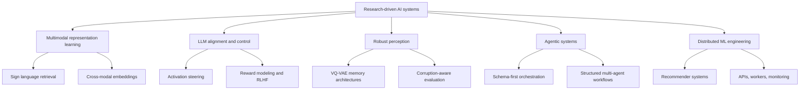

# Nakato

**AI Engineer building research-driven systems**  
**Multimodal learning, controllable LLMs, robust perception, and distributed ML infrastructure**

<a href="https://nakato156.github.io/nakato156/">Portfolio</a>

 

---

I work on **AI systems that are both experimentally grounded and deployment-aware**.
My projects usually sit between **research questions** (representation learning, robustness, controllability, alignment) and **engineering constraints** (protocols, infra, monitoring, APIs, reproducibility).

## Research map

## What I optimize for

- **Research with a concrete hypothesis** instead of vague experimentation.
- **Small or modular systems** that can actually be trained, debugged, and deployed.
- **Evaluation-first workflows** with explicit baselines, trade-offs, and measurable gains.
- **Readable engineering**: protocols, structured interfaces, reproducible pipelines, and clear failure boundaries.

## Selected work

| Project | Why it matters | Stack |
|---|---|---|
| [DeMemte](https://github.com/nakato156/Dememte) | Explores **latent memory with VQ-VAE + attention** for image classification robustness, with emphasis on **fair corruption-aware comparisons** instead of inflated baselines. | PyTorch, VQ-VAE, Transformers, robustness |
| [Imitator](https://github.com/Percep3/Imitator-waimlap) | Small multimodal model that maps **sign video to text embeddings**, extending language-model-facing systems with **sign-language-aware representations**. | PyTorch, multimodal embeddings, sign language |
| [NADO](https://github.com/nakato156/nado) | **Schema-first multi-agent system** for 8-bit composition with explicit roles, JSON protocols, and orchestration. | Python, LangChain, Pydantic, agents |
| [ActivAdda](https://github.com/nakato156/ActivAdda) | Practical implementation of **activation addition / steering vectors** to bias LLM behavior without weight updates. | Jupyter, Python, interpretability |
| [World-model](https://github.com/nakato156/World-model) | Early exploration of **world models + deep RL** for robot navigation in simulated environments built over GTA V. | Python, RL, VAEs, simulation |

## Current themes across my repositories

- **Multimodal alignment**: gesture, vision, language, embedding spaces.
- **LLM control**: activation steering, reward modeling, behavior shaping.
- **Robust models**: memory-augmented architectures and corruption-aware evaluation.
- **AI systems engineering**: multi-agent protocols, service decomposition, monitoring, and distributed execution.

## GitHub activity

